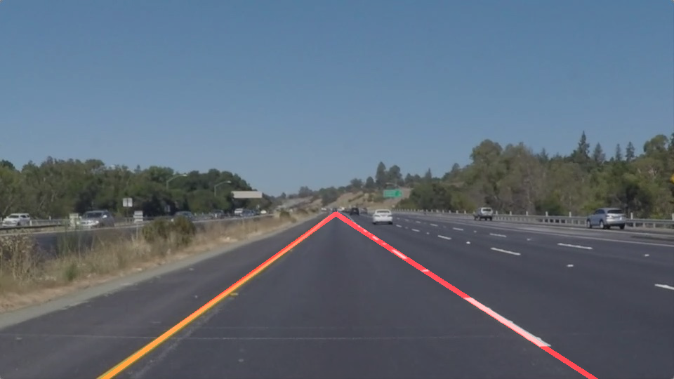
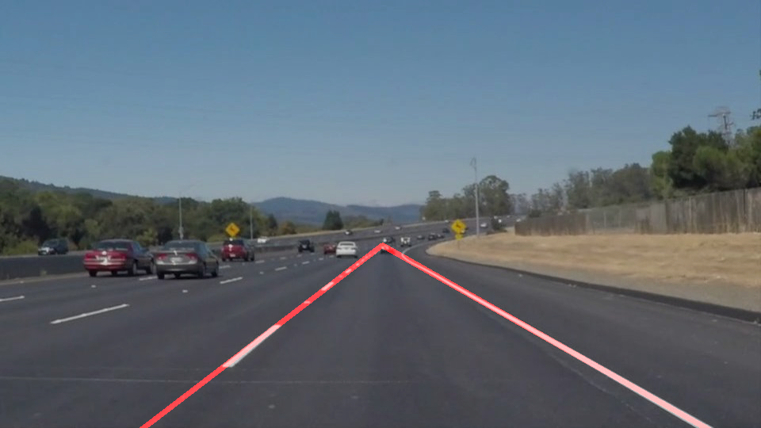

**Finding Lane Lines on the Road (Basic)**
==========================================

[Self-Driving Car Engineer Nanodegree Program](http://www.udacity.com/drive)

Description
-----------

When we drive, we use our eyes to decide where to go. The lines on the road that
show us where the lanes are act as our constant reference for where to steer the
vehicle. Naturally, one of the first things we would like to do in developing a
self-driving car is to automatically detect lane lines using an algorithm.

In this project basic lane lines detection will be developed using Python and
OpenCV. OpenCV means "Open-Source Computer Vision", which is a package that has
many useful tools for analyzing images.

This project has been developed using also a [Jupyter
Notebook](https://jupyter.org/) which made the prototyping very quick.

Dependencies
------------

In order to successfully run the Jupyter Notebook containing the code, several
dependencies need to be installed.

[CarND-Term1-Starter-Kit](https://github.com/udacity/CarND-Term1-Starter-Kit)
contains the starter kit needed for this purpose. During the development
[Anaconda platform](https://www.anaconda.com/) was used.

Implementation design
---------------------

Given a color photo of the road, taken from the middle of a lane, this algorithm
returns as an output the same image with the lane (straight) lines highlighted
with a color.

The pipeline of the algorithm is basic and does not involve advanced techniques
of computer vision:

1.  8-bit grayscale conversion

2.  [Gaussian
    Blur](https://docs.opencv.org/3.1.0/d4/d13/tutorial_py_filtering.html)
    filtering to reduce the noise

3.  [Canny
    detection](https://docs.opencv.org/3.1.0/da/d22/tutorial_py_canny.html)
    (which includes Gaussian blur filtering) to detect edges

4.  Region of interest selection

5.  [Hough lines
    transform](https://docs.opencv.org/2.4/doc/tutorials/imgproc/imgtrans/hough_lines/hough_lines.html)
    using OpenCV HoughLinesP function. After this step a list of segments in the
    form [x1,y1,x2,y2] are returned

6.  Discard segments that are shorter than a threshold. In case all the segments
    are shorter, consider all of them

7.  Separates the segments in two sets: positive slope (left lane) and negative
    slope (right lane)

8.  For both positive and negative slope segments:

    1.  Compute the mean and the standard deviation (`std`) for the segments
        slope

    2.  Remove the segments with slope different more than `1.5*std` from the
        mean slope

    3.  Compute the mean for slope and intercept of the lines associated with
        the segments (i.e. compute the mean right and left lane line)

9.  Find the intersection between the two lines

10. Draw over the original images the segments identifying the lanes starting
    from the bottom of the image to the intersection

 

Below some examples of the pipeline in action:

 

Input:

Output:

Input:

Output:

 

Under `./test_videos/ `and `./test_videos_output/` there are some video examples
in which the pipeline has been applied for each frame.

 
